# 2 0 2 4KOL发展年报

# CONTENTS目 录

大盘数据概览

02KOL行业变革焦点COMI< 2024年 > 克劳锐

03 TOPNhauBaBKOL行业商业化焦点2024年 >

04 WOUT.COM从【流量竞争】到【价值竞争】ou

# OVERVIEW概 述

# 大盘数据概览

24年万粉以上创作者规模近1500万，年增速5% ，中腰部KOL连续三年成为增长主力，行业整体呈现增速放缓，结构优化的特征；内容生态上，短、直、长、音多元形式加速融合，社会价值的转向加速了文化、三农等行业的增长；

# KOL行业变革焦点

KOL行业变革的焦点凸显了平台去中心化、垂类深耕及生态差异化的重要性；中长视频凭借沉浸式体验展现出强劲增长潜力，内容创作从单一赛道转向跨域破圈，人文社科等垂直领域持续崛起，技术赋能与文化传承成为内容创新的重要主线；

KOL行业商业化焦点

存量时代倒逼行业重构增长逻辑，以抖音和小红书为例，抖音内容向质升级，在头部强转化的基础上，腰肩部稳平衡，以精品内容加速转化；小红书突破「绝对女性主场」标签和高垂品类，在原有优势领域基础上向生活服务等更多领域扩展；

从「流量竞争到「价值竞争

面对竞争内卷，行业正从「流量争夺」转向「价值深耕」，通过技术升级优化内容体验， 以KOL跨界联创与情绪共鸣构建深层用户链接，同时，动态标签化细分实现精准营销。2024年KOL生态既是效率博弈，更是价值重构中的多元突破；

# 大盘数据概览

短视频/直播大盘情况万粉以上KOL分布情况TOPKL.OUT.C 租克劳盟海外内容创作者专题

「短」视频内容呈稳健发展态势，「短、直、长、音」互融互动催生新增长

TOPKL.OUT.CO短视频 直 播TOPKL.C用户规模10.4亿，使用率达93.8% 用户规模8.33亿TOPKLOUT 国克势继近五年用户来规增模速、持使续用放时缓长后稳，居首第次一出现回落 0 更多推内动容电创商作生者态参持与续直完播善带货 TOPKLOUT COMTOPIKL.OUT.COWRCONOMI 长视频 音 频用户规模7.25亿 用户规模3.35亿TOPKLOUT.COMR创2018年以来新高，回暖 对比2023年基本持平大屏市场改善，大小屏融合趋势明显 声音经济的增长潜能待释放TOPKL.OUT.COWRTOPKLOUT COMT

# 流量增量空间持续收窄，典型社媒平台用户规模进入稳定期

2023\~2024年五大典型平台单机单日有效使用时间 （分钟）  
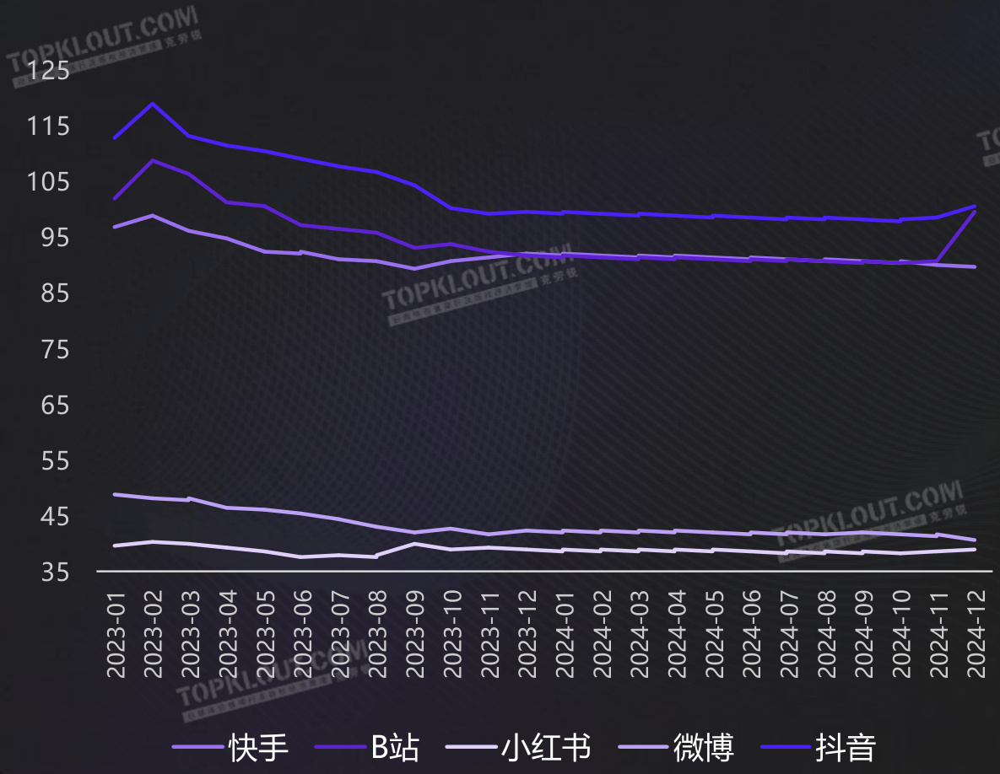  
数据来源：第三方数据监测平台；

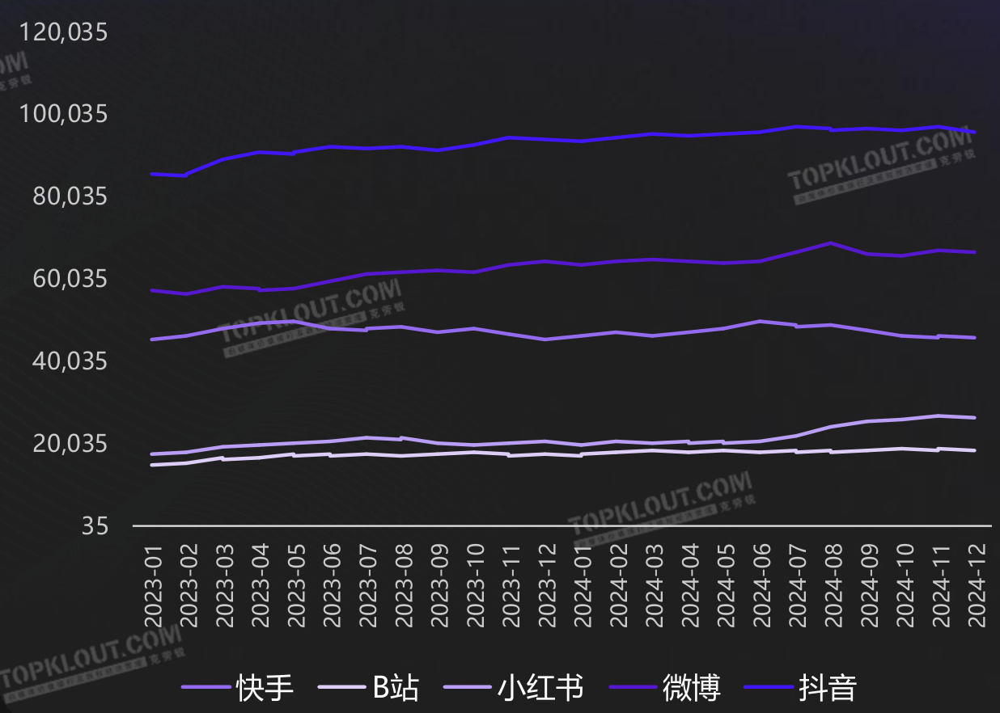  
2023\~2024年五大典型平台MAU表现（万台）

24年万粉以上创作者规模近1500万，年增速5%，总量攀升，增速呈放缓态势

2020～2024年主要平台万粉以上创作者规模  
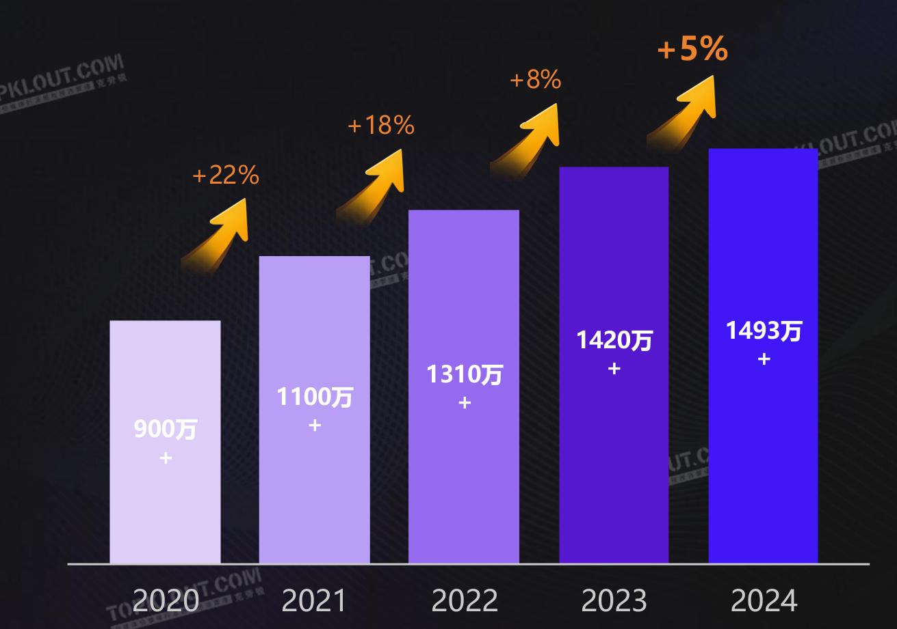  
来源：克劳锐指数研究院自主研究及绘制；注释：数据统计范围：截至2024年12月31日，抖音、快手、小红书、微博、B站五大平台中，粉丝量在万粉以上的创作者；

# 「慢下来」

成为过去一年内容创作者发展和创作的主旋律

# 超头部稳定，突破空间狭小，中腰部黑马频出，连续三年成为增长主力军

2024年万粉以上不同粉丝量级KOL分布情况  
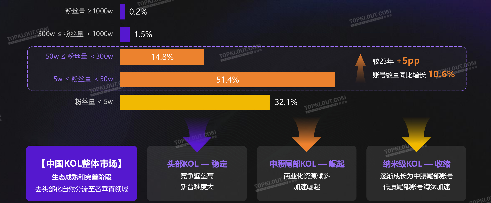  
来源：克劳锐指数研究院自主研究及绘制；注释：数据统计范围：截至2024年12月31日，抖音、快手、小红书、微博、B站五大平台中，粉丝量在万粉以上的创作者；

# 创作者分布热门赛道呈稳定态势，社会价值的转向加速了内容生态的升级与重构

# 2024年创作者分布TOP10垂类

「生活记录」以总占比TOP1和增速TOP5的两方面跨维度优秀表现，成为连接大众刚需与增量市场的核心赛道

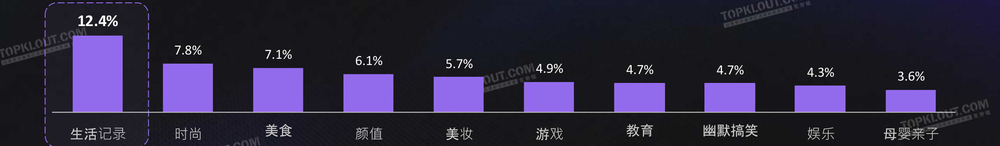

# 2024年粉丝增速TOP10垂类

互联、三农」等垂类的高速增长，也同时折射出了社会价值的转向，如用户精神消费的升级、数字技术的发展与普惠和乡村振兴势能等

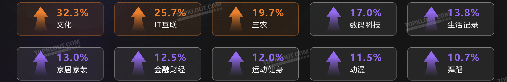  
来源：克劳锐指数研究院自主研究及绘制；注释：数据统计范围：截至2024年12月31日，抖音、快手、小红书、微博、B站五大平台中，粉丝量在万粉以上的创作者；

国内万粉以上海外创作者超两万，腰尾部KOL占比超96%，高潜力与高壁垒并存

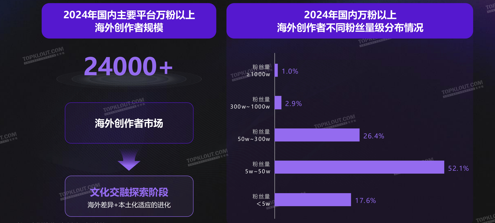  
来源：克劳锐指数研究院自主研究及绘制；注释：数据统计范围：截至2024年12月31日，抖音、快手、小红书、微博、B站五大平台中，粉丝量在万粉以上的海外创作者；

# 海外创作者在中国社媒的生活切片「突围战」，以生活流内容撬动情感共鸣

2024年海外创作者在中国社媒分布的TOP10垂类  
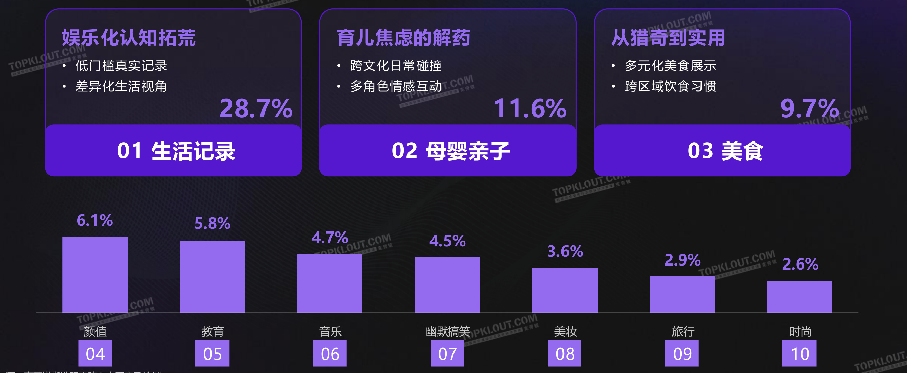  
来源：克劳锐指数研究院自主研究及绘制；注释：数据统计范围：截至2024年12月31日，抖音、快手、小红书、微博、B站五大平台中，粉丝量在万粉以上的海外创作者所分布的垂类领域；

# 更多的中国创作者在海外社媒的润物实践，加强了中华文化与生活的输出

2024年外网讨论高热度内容  
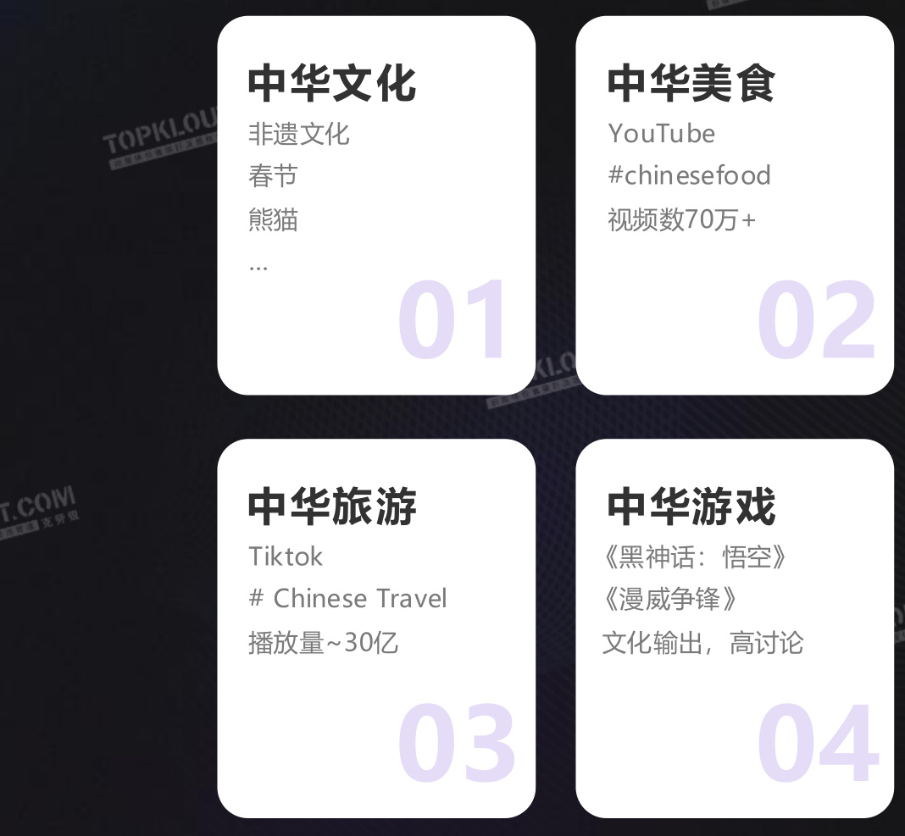  
来源：克劳锐指数研究院自主研究及绘制；

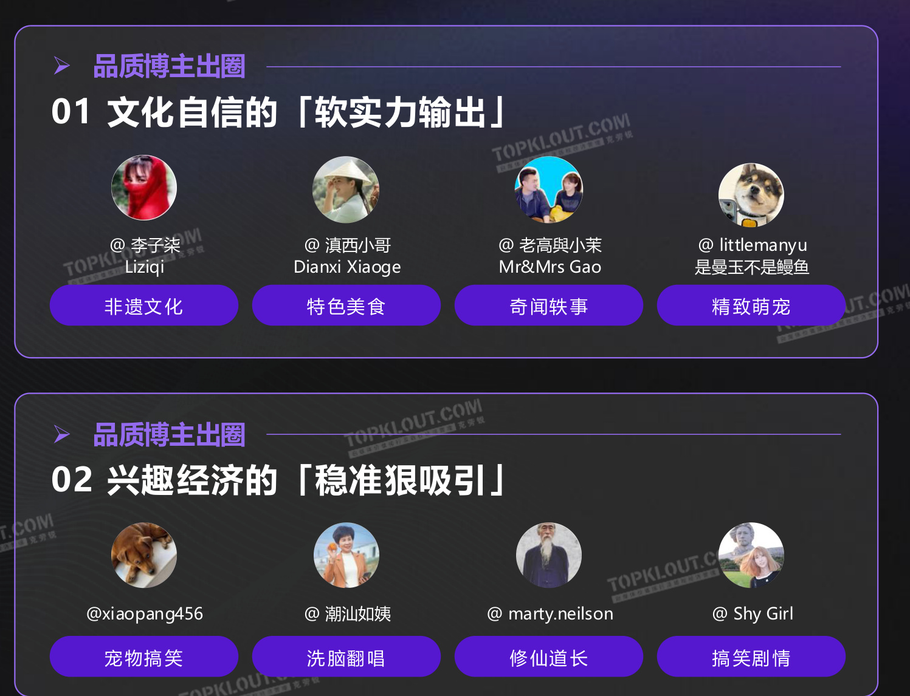

# KOL行业变革焦点

典型平台万粉以上KOL表现KOL行业内容变革焦点

# 去中心化驱动中小博主崛起，头部效应依然存在，中长尾新势力在博弈中催生

2024年KOL生态以中小博主为核心基石，随着内容平台持续呈现去中心化趋势，尽管短视频与社媒平台仍存在一定的头部效应，但中小KOL群体占比正稳步提升。其中，小红书与B站凭借活跃的腰尾部创作者生态展现出显著的中长尾优势，为新型KOL的成长提供了肥沃土壤。

2024年典型平台不同粉丝量级KOL占比  
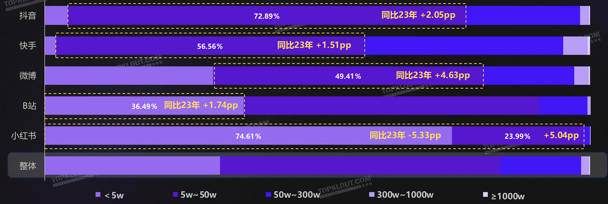  
来源：克劳锐指数研究院自主研究及绘制；注释：数据统计范围：截至2024年12月31日，抖音、快手、小红书、微博、B站五大平台中，粉丝量在万粉以上的创作者；

# 用户注意力向腰尾部分散，平台算法、用户内容消费习惯与商业化共塑涨粉格局

以抖音、快手为主的短视频平台头部效应显著，头部KOL涨粉表现优异，平台算法助推爆款内容与头部创作者，商业化成熟，但新人突围难度相对较大；小红书和B站得益于推荐机制扶持及平台属性，用户偏好分散，更关注实用性与垂直内容的成长型KOL，不完全以流量为导向。而微博因内容生态成熟，整体涨粉平缓，中腰部创作者活力待激发。

2024年典型平台不同粉丝量级KOL涨粉情况  
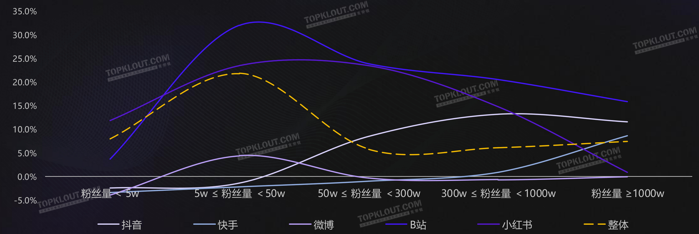  
来源：克劳锐指数研究院自主研究及绘制；注释：数据统计范围：截至2024年12月31日，抖音、快手、小红书、微博、B站五大平台中，粉丝量在万粉以上的创作者；

# 用户需求决定内容供给，平台因需定策挖掘并深耕亮点垂类，打造生态差异化

亮点垂类：人文社科、科普科技、 财经、美食、旅行、时尚

亮点垂类：泛知识、教育、三农、 幽默搞笑、招聘、房产…

亮点垂类：体育、游戏、汽车、科技数码、大健康、动漫…

内容创作的趋势整体向高内涵、强实用、精制作、深度内容转型；

以真实化和生活化驱动，从娱乐消费到知识分享，满足用户多元需求；

垂直内容的深耕为用户多元观点的碰撞提供场域，线上垂直社交圈层价值凸显；

24年，对比4\~5月均值，6月的30分钟以上视频条均播放量增长超27倍【1】

24年，快手泛知识直播间，观看时长同比增长  
96.4%【2】

24年，微博垂直生态金V规模增幅54%，超过了IP生态和媒体热点的增长【3】 OIT.CC

# bibiti

# 小红书

亮点垂类：游戏、动漫、科技、汽车、文化、教育…

亮点垂类：美妆、时尚、家居家 装、旅行、出行、萌宠…

在保持核心圈层优势的同时向多元领域扩展，在弹幕文化的影响下构建更多垂直生态圈；

垂类聚焦从消费品满足向多行业的需求扩展，重点向生活服务等垂类进行突破；

24年百大UP主，知识区以上榜22位居于第二，涵盖了科技、历史、文化等多领域【4】

24年，小红书月均产生旅行相关搜索16亿次，搜索量同比增长61% 【5】

# 内容消费：多元内容格式进一步交互融合，以组合的形式面向用户

用户内容消费进一步向短视频、直播等高互动性、即时性强的格式倾斜，传统内容虽占主导但增长乏力。多任务处理和碎片化消费仍为主要趋势，与此同时，高精专内容的潜力不断凸显。

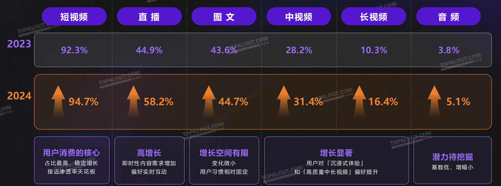  
来源：克劳锐指数研究院自主研究及绘制；

内容边界：内容创作者回归用户需求，面临从内容生产到用户共深的范式跃迁TOP!用户需求解码 TOPKLOUT.COM内容创作者变成用户需求的工程师，把创意、内容、数据进行三维统和，在跨平台经营层面根据不同平台重构内容形态  
TOPKLOUT. 内容创作者 用户需求工程师 的同时，不断扩展和深耕潜力垂类赛道，模糊内容赛道边界TOPKLOUT.COMEFOPKL.OUT.COM在动态博弈中创造价值增量 垂直场景渗透 PIKLOUT.COMI 强势赛道加速发展 02 突围 03热门赛道KOL持续挖掘细分需求单一场景  →  多关联场景 行业竞争催生专业内容升级 TOPKL.ODJ推动社会热点推动细分赛道崛起原跨内域容赛道  切→换  新流量赛道 TOPICL 非赛专道业流KO量L差红异利化显内露容冲击专业领域 自加我码关注升级，加码对小众领域关注TOPK 热门赛道「跨域破圈」 专业领域「降维打击」 冷门赛道「热度升级」借势热门赛道捕获新流量 非科班达人涌入热点赛道 挖掘细分需求，内容再出圈PK1.0

# 内容形式：匠心沉淀，与创意共生，差异化内容突围，加速升级

从热门聚焦向多元领域拓展，精准捕捉时代共通的情绪。在内容模式上创意创新，紧扣目标用户群体的特性，创造差异化内容，实现内容升级。ITCOM

# 长视频的品质化突围

让观众看到「什么是真正的内容」

# 差异内容的精品化创造 OM明

用「钱+创意+时间」劝退同行

9

画面高清，制作精良对主题进行深入剖析打造沉浸式的观看体验

致敬曹雪芹先生

  
@ 李子柒

本视频耗时5个月制作，共计450分钟为你深度解读中国名著《红楼梦》其中包括原著的讲解和历史介绍一口气带你读懂中国名著《红楼梦》选题剑走偏锋投入成本加大挖掘冷门兴趣领域

# 团播的创意化制作

用「能力+场景+设计」展示团队力量

# 适老化与科普低门槛

「反卷内容」一看就懂，越懂越想看

の

运镜高级，特效华丽 剧情化编排，场景化设计 TOPKI 直播与录制切片丝滑穿插

  
@ 维C动物园

Z

语言通俗易懂内容产出贴近生活• 老年友好，代入感强

内容传承：本质是人与内容的共同进化，内容因人的创造性转化而获得永恒流动

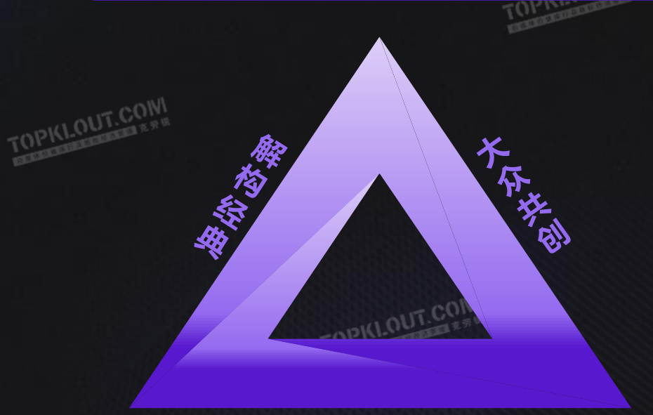  
文化传承的多元路径  
技 术 赋 能

成都翻山 唯大英雄 品本色 这俩人儿那吵架吵得好好儿的突然画风就变了  
@星球研究所 @渤海小吏 @米三汉以地理视角 凭借超级钻研 带领用户  
呈现世界的奇妙之处 生动解读历史风云 重新解读经典名著 TLOUT.C IV地 理 历 史 名 著心OM  
《星际穿越》 《大地演讲》系列河北 不白吃的造字神助攻诺兰与李白 主讲人超乎想象的河北@风过大泽 @时差岛 @我是不白吃  
通过专业拉片手法 帮助用户 以趣味形式剖析影视艺术魅力 OM 感受不同独特风情 揭示生活背后心理奥秘TOPKL.OUT 克劳锁影 视 城 市 心 理

创作者即是「传承人」，守护内容内核，又是「传播者」，通过技术和跨学科视角创新表达，将内容转化为具象化、可感知的现代叙事，搭建传统与现代的桥梁。

  
来源：克劳锐指数研究院自主研究及绘制；

# KOL行业商业化焦点

商业化焦点概览商业化规模 COMFOPKL.OUA 克劳盟商业化程度

存量时代，流量成本高企，用户需求升级，中长尾KOL重构增长逻辑平台通过差异化策略，注重服务质量与用户需求，聚焦优势板块，优化商业模式

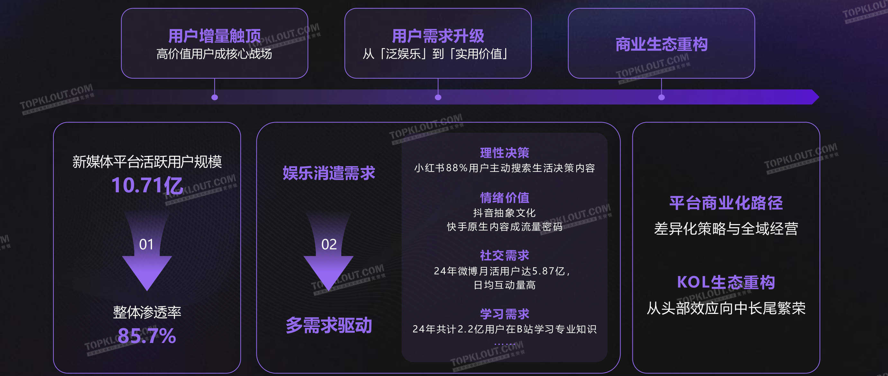  
来源：【1】QuestMobile，截至24年10月，包括抖音、快手、小红书、B站、微博在内的新媒体平台；【2】平台方公开信息。

抖音电商GMV3.5万亿，同比+30% 【1】 TOP2000SPU各行业增速远超大盘 2024年 【2】 广告及营销收入15亿美元，同比-2% 2024年 【3】  
以算法驱动的爆款经济为核心，通过全域电商 以「工具型社区」定位强化平台的种草价值 强化垂直内容生态与跨圈层传播，  
与本地生活双引擎，实现商业价值的提升 「买手电商+精细运营+私域链接」构建闭环 巩固了其作为「热点发源地」的核心价值OPKL.OUT内容和商业双向循环 小红书 加速私域破局 社交传播优势驱动TOPKL.OUT.COW2024年 【4】 2024年 【5】 2024年 【6】  
快手电商GMV1.39亿，同比+17.3% 近310万UP主获利，收入同比+21% 微信小店GMV达23年的1.92倍斤  
以信任经济为基础，通过普惠算法与垂类内容 以优势垂类为核心竞争力，通过大开环生态拓 依托微信社交关系链，构建去中心化电商生态，  
深耕，构建高粘性社区与信任电商闭环 展变现场景，助力腰尾部创作者商业价值提升 以公私域联动挖掘社交信任价值COM  
8 信任电商的生态升级 bilblit 垂类深耕的商业化破局 视频号 社交裂变的新势力

KOL行业转向效率竞争，平台通过工具迭代与生态扶持，推动商业化持续深入

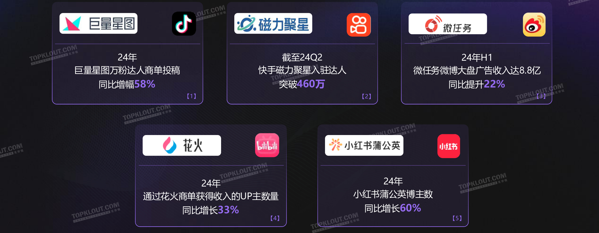

# 抖音借腰肩KOL造流量，小红书以腰尾KOL低成本种草，B站凭中腰KOL传递内容

2024年典型平台TOP20000账号粉丝量级分布  
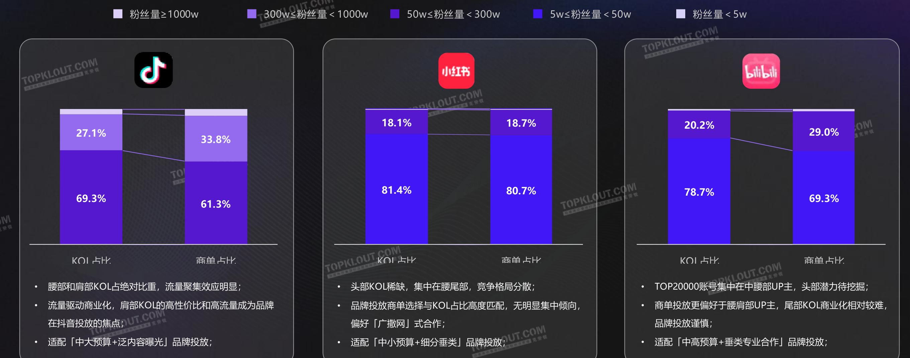  
来源：克劳锐指数研究院自主研究及绘制；注释：数据统计范围：截至2024年12月31日，抖音、快手、小红书、微博、B站，各平台粉丝量排名TOP20000创作者；

抖音优质内容加码商单转化，小红书生服扩展突破高垂品类，B站商单多领域渗透

21.7% 10.0% OPKLOUTC 5.9% 5.7% 5.6%影视 娱乐 幽默搞笑 生活记录 开箱测评a OIKLOUTCOM 随着短剧的爆发，「影视」成为吸引品牌植入合作的强势板块，同时，虽然泛娱乐商单 仍排前列，但占比较低，生态整体逐渐向精品化转型，升级创作者服务，加码优质内容；TOPKLOUTCOM18.3% 14.3% 13.6% 7.4% 4.7% 2024年典型平台 SOPKLOUT.CONR小红书 美妆 时尚 美食 母婴亲子 家居家装 ↑ • TOP20000账号小红书逐渐打破「绝对女性主场」标签，TOP商单正逐渐从高垂品类向生活服务扩展，基 TOPKLU 商单前五垂类于平台的实用性和代表性用户画像，品牌投放的精准度高，优势板块商业化成熟；OMTOPKLO20.8% 9.1% 8.1% 6.7% 6.2% TOPKLOUT.CObilbti OUT 游戏 动漫 幽默搞笑 生活记录 美食 興B站在圈层文化认同与内容深度绑定的基础上，通过内容生态延伸，构建覆盖年轻用户全生命周期的多元消费场景，商单也从垂直圈层向多元文化领域渗透； TOPIK

# 典型社媒平台商业化表现

『

# 小红书

商业化情况—直播/购物车覆盖  
内容生产力—作品发布数  
内容吸引力—完播率苗PIKL.OUT.C充务锁  
用户参与度—互动率  
四大类型达人基础情况  
四大类型达人商业化表现  
商业化情况—主播覆盖、活跃粉丝  
内容生产力—作品发布数TOPKL  
内容吸引力—完播率、3s阅读率  
用户参与度—互动率  
用户认可度—千赞笔记比例  
笔记阅读来源分布情况

本报告将聚焦抖音与小红书的商业化表现进行展开，作为短视频流量生态与内容社交的典型平台TOPKL.OU 二者差异化对比清晰呈现了行业核心商业表现与趋势共性

抖音的KOL生态呈现头部强转化、中部稳平衡、尾部长尾蓄力的特点➢ 头部KOL高覆盖高转化，商业作品占比高，个人内容受挤压，泛娱乐内容相对弱化；

# 腰部KOL

」

平衡发展，作品数和商业化程度均在线，兼具内容量与变现效率；

尾部KOL长尾潜力待释放，内容高产，但商业化程度还相对较弱；

用户对商业内容防御性强，真实内容成互动核心

达人类型分工明确，传播型和种草型达人主导流量大盘，种收一体型和转化型完成高效转化

# 抖音头部KOL具有「双高」价值，尾部KOL商业化意识和长尾价值待进一步挖掘

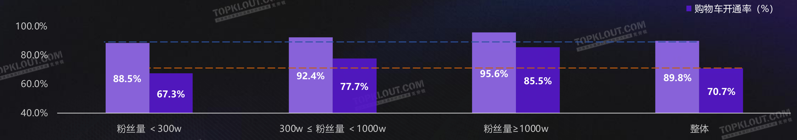  
2024年抖音TOP20000账号商业化情况

主播覆盖情况89.8%购物车开通情况70.7%

4年抖音  
TOP20000账号  
入驻星图的KOL达  
93.3%

其中，入驻星图的KOL中，主播率达9 6.3 % TOPKL.可租你机热区v 基于平台算法流量的资源倾斜和头部KOL的高变现需求驱动，TA们对于直播打赏、电商直播带货等直接变现方式的依赖度相对较高，腰尾部KOL的电商潜力尚未完全释放；

其中，入驻星图的KOL中，开通率达7 5.8 %  
TOPKLOOT  
各量级KOL的购物车覆盖率整体低于主播覆盖率，中腰部KOL直播相对活跃但基于供应链资源缺乏、选品能力弱、团队待优化等成长瓶颈，商业转化待进一步释放；

# 抖音KOL商业化生态呈现「头部主导商业化，中小聚焦内容量」的生态格局

2024年抖音TOP20000账号内容生产力  
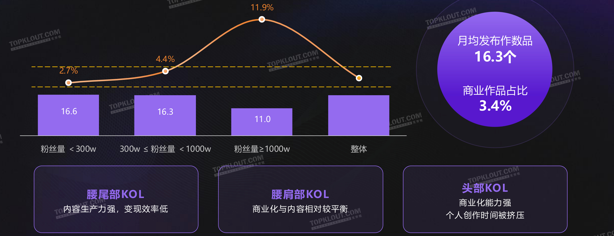  
来源：克劳锐指数研究院自主研究及绘制；注释：数据统计范围：2024年全年，抖音平台粉丝量排名TOP20000创作者中入驻巨量星图创作者的数据表现，统计维度含账号基础信息、内容表现等公开信息（不含商业敏感数据）分析以入驻星图的达人对外展示数据和字段为准，仅供参考，一切以实际情况为准；

# 抖音完播率与粉丝量强正相关，互动率差异小， 用户对商业内容的防御机制明显

PKL.OU2024年抖音TOP20000账号内容吸引力 TOP90日_商业作品_平均完播率(%) 商业作品的完播率显著低于个人作品— 完播率 TOPKLOUT.CO90日_个人作品_平均完播率(%) 用户对广告内容耐心有限TOPKL.OUT.COM【 商业作品 】0TOPKL.OUT 完播率与粉丝量级呈强正相关，头部凭借专业制作 和信任，显著提升商业作品的用户留存；13.09% 14.44% 15.41% ADIKLOUT.COMI 13.54%O 【 个人作品 】2.78% 3.81% 5.26% 3.15% 各粉丝量级完播率差距较小，用户对优质个人内容粉丝量 ＜300w 300w ≤ 粉丝量 ＜1000w 粉丝量≥1000w 整体 的观看意愿普遍较高 TOPIKTTOIPKLOUT COMTOPKLOUT.CO2024年抖音TOP20000账号用户参与度 商业作品与个人作品的互动率差距微弱90日_商业作品_平均互动率(%)— 互动率 用户偏好真实内容的天然互动90日_个人作品_平均互动率(%)0 【 商业作品 】- 不同量级间的差距远低于完播率，边际效益递减，2.59% 2.69% 2.1725% 2.62% 用户对广告的互动行为更谨慎；1.54% 1.78% 1.63%【 个人作品 】TOPI 各量级差异微弱，用户对真实内容具有较高包容性，粉丝量 ＜300w 300w ≤ 粉丝量 ＜1000w 粉丝量≥1000w 整体 互动行为不受粉丝量级显著影响；

来源：克劳锐指数研究院自主研究及绘制；

# 抖音达人生态类型呈现金字塔结构，传播型撑起流量大盘，转化型创造核心价值

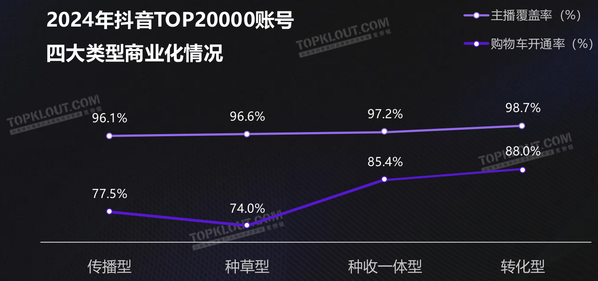

# 传播型达人 种草型达人

所有受众中，观看互动受众占比较高，传播效率高

与 达 人进 行 深 度互 动 达 到「喜欢」的受众占比较高

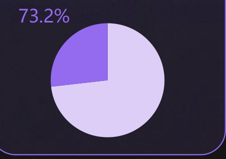

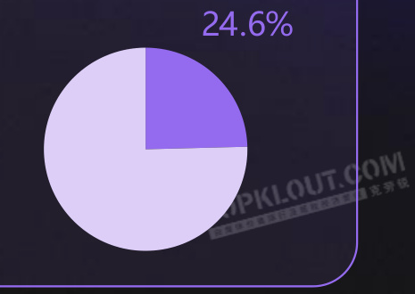

# 种收一体型达人 转化型达人

关注这类达人的受众，粘性很好，被转化的可能性更大

已在达人处进行了下单/ 下载等行为的受众占比较高

# 占比重较高，商业化有限 稀缺但高价值

两类达人占比较高，尤其是传播型达人，主导生态，但整体商业化仍待进一步激发；

两类达人占比仅2.1%，但购物车开通和主播覆盖率极高，其「流量—转化」闭环能力较强

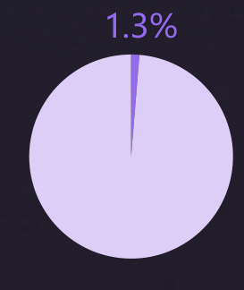

# 达人类型分工明确，传播/种草型承担话题和流量入口，种收/转化型聚焦后端转化

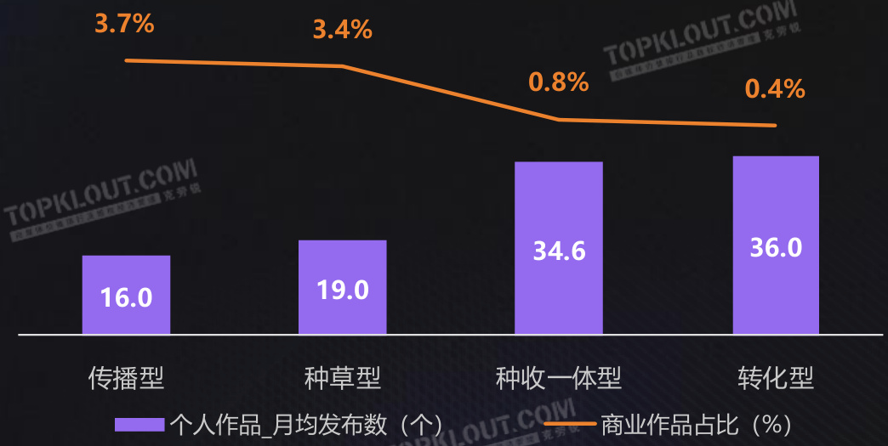  
2024年抖音TOP20000账号——内容生产力

传播型&种草型的完播率优势显著，浅层种草内容更能吸引用户完整观看，但转化型的泛流量和精准触达或将弥补这一短板；

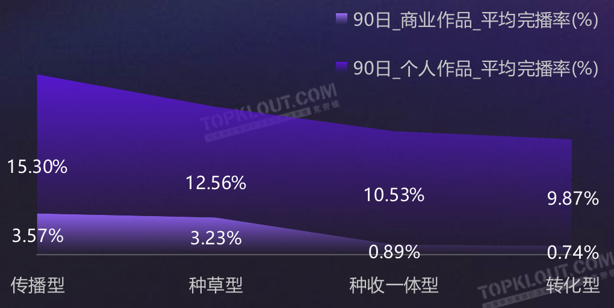

# 传播型 & 种草型

高频发布商业作品，以量取胜，商业化效率较高通过大量曝光类商业内容触达用户

# 种收一体型 & 转化型

低频高质，聚焦深度价值，商单占比低但单产高商单内容生产周期长，质量高，更注重用户信任积累

传播型达人通过泛内容和高共鸣内容互动率高，转化型达人互动率虽相对较低，但其高发布量加持，在用户粘性上仍具优势；

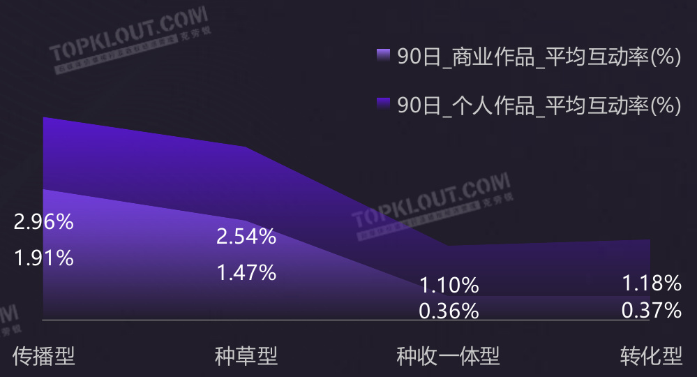

# 达人类型分工明确，传播/种草型承担话题和流量入口，种收/转化型聚焦后端转化

千万粉以上的头部KOL在「种草型」和「转化型」强势发力，TGI分别为117.6和163.5，远超平均水平，「流量+转化」的双引擎价值凸显，传播型相对较弱，用户对头部KOL的商业化内容更追求实用价值，泛娱乐次之；腰肩部KOL整体表现平稳，「种收一体型」成黑马，内容兼具种草与收割属性，用户接受度高，商业化效率较突出；腰尾部达人主要通过差异化传播和低成本高转化的种收一体突围； TAPKLOUT

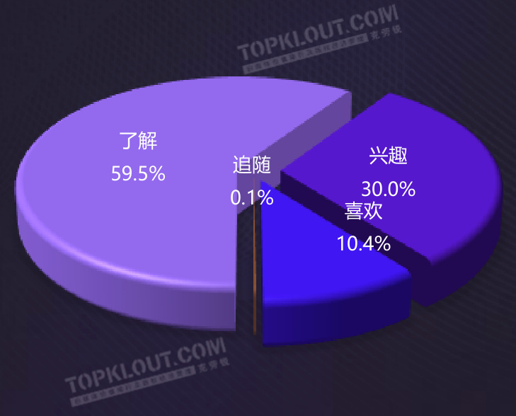  
2024年抖音TOP20000账号整体用户画像

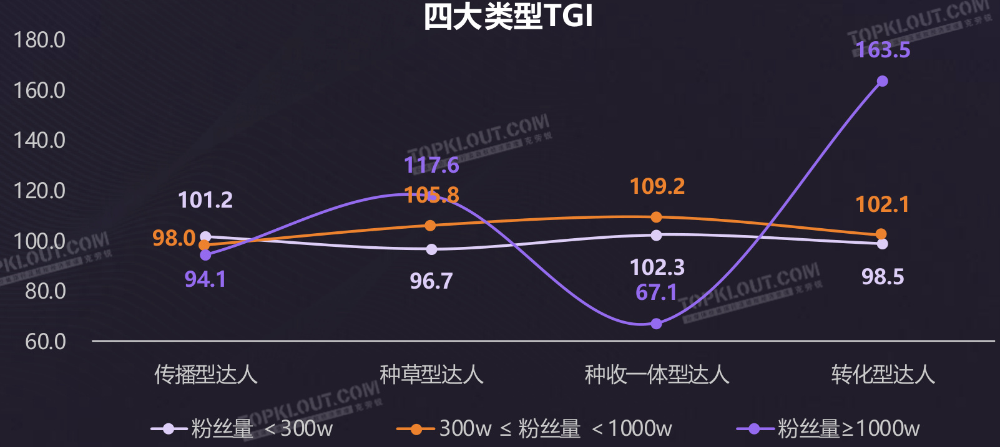  
2024年抖音TOP20000账号

小红书KOL生态呈现头部强曝光，腰尾部高频输出高商业转化的特点

➢ 蒲公英平台为核心载体，商业化覆盖率高腰尾部KOL精准触达活跃粉丝高占比

视频主导商业化，腰尾部商业化效率突出，头部侧重内容维护TOF视频内容多但商业笔记占比低，视频更注重流量而非直接转化；腰尾部在图文和视频领域均展现高商业化潜力； IT.COMI

爆款偏好分化，超头部图文优势显著，视频长尾效应强视频千赞比例整体高于图文，但用户对商业内容的敏感度较高；

蒲公英已成商业化核心载体，主播覆盖率极高，活跃粉丝高占比驱动商业化效率

LOUT.COM 主播覆盖情况TO2P42年00小0红0账书号 新口迎充劳锁 01 95%入驻蒲公英的KOL达TOPKL.OUT.C充务锁 85.1% 其主中播，率入达 驻97蒲.公2英%的KOL中，TOPKLOU

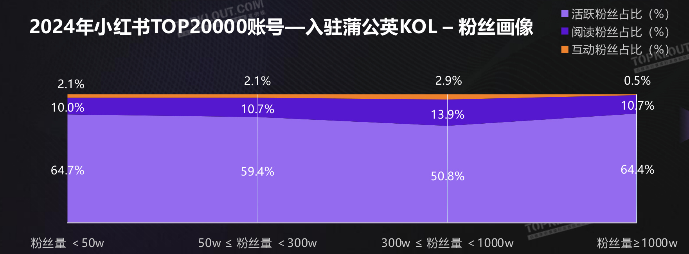

活跃粉丝占比02 TOF 61.8%修口话其中，入驻蒲公英的KOL中，活跃粉丝占比达 63.6%整体来看，粉丝量并非商业化能力的唯一标尺

➢ 腰尾部K OC以强用户粘性和高活跃精准触达  
➢ 腰肩部K OL以高质内容获高阅读率 高效种草  
➢ 超头部K OL强曝光低互动，粉丝以围观为主

整体笔记月均发布数 TOPKL.OUT.COM 2024年小红书TOP20000账号内容生产力 视频-月均笔记数量（篇）9.3 篇 —作品发布数 视图频文-商月业均笔记占数比量（%篇）图文-商业笔记占比（%）TOPKLOUT.CO分 视频笔记占比 9.1% 10.1% 7.7%80 ECOIV 4.5%% 7.2% 7.5% 5.4%➢ 视频内容主导商业化，图文呈现量级分化，腰尾部KOL图文商业化程度较高， TOPIL. 0.1%商业笔记占比 头部账号或将更依赖广告之外的变现模式，如：电商、直播、私域导流等；7.7% COM图文 - 商业笔记占比 ➢ 超头部KOL：9.2% 注重内容生态的日常化维护，高频更新巩固粉丝粘性，但商业化策略趋于谨慎；➢ 腰尾部KOL：视频 - 商业笔记占比 在图文和视频领域均展现出较高的商业化潜力，商业活跃度较为突出；COMTOPI 7.3% 粉丝量 ＜50w 50w ≤ 粉丝量 ＜300w 300w ≤ 粉丝量 ＜1000w 粉丝量≥1000

# 用户对视频的深度参与和图文的快速浏览鲜明分化，图文快速浏览习惯凸显

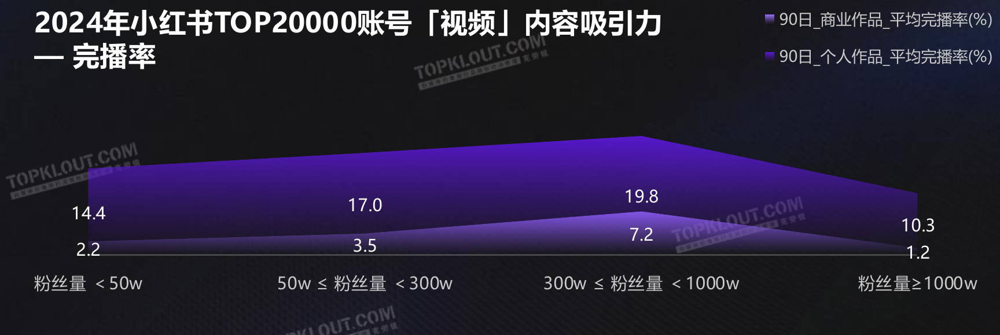  
来源：克劳锐指数研究院自主研究及绘制；

2024年小红书TOP20000账号「图文」内容吸引力 90日_商业作品_平均3s阅读率(%)  
— 3s阅读率 90日_个人作品_平均3s阅读率(%)TOPKLOUT.C免势锁74.5393..5 TOPKL.OUT.COMR 26..94 230..23 CAPKL.OUT.COM 36.2  
粉丝量 ＜50w 50w ≤ 粉丝量 ＜300w 300w ≤ 粉丝量 ＜1000w 粉丝量≥1000w

视频 整体完播率 14.9 O 商业笔记完播率 2.5 %

# 视频完播率

日常内容显著优于合作内容，腰肩部KOL表现亮眼，粉丝忠诚度高；

# 图文3s阅读率

超头部账号断层领先， KOC表现较优，合作内容与日常内容反差显著；

图文 3s阅读率32.1 %

商业笔记3s阅读率9.0 %

# 用户对视频的深度参与和图文的快速浏览鲜明分化，图文快速浏览习惯凸显

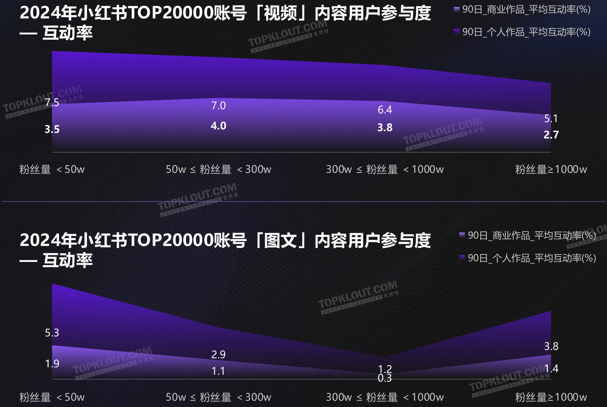

图文+视频 整体互动率OUT.COM 6.1 %

商业笔记互动率2.7 %

互动率与粉丝量整体呈负相关腰尾部KOL粉丝群体更垂直，互动粘性高；腰肩部、头部KOL泛流量占比大，用户参与深度欠佳；

种草平台的「信任阈值」差异商业内容与个人内容的互动率差异小，用户对商业内容的互动防御性相对较弱，对软性种草接受度高；

# 用户对视频的深度参与和图文的快速浏览鲜明分化，图文快速浏览习惯凸显

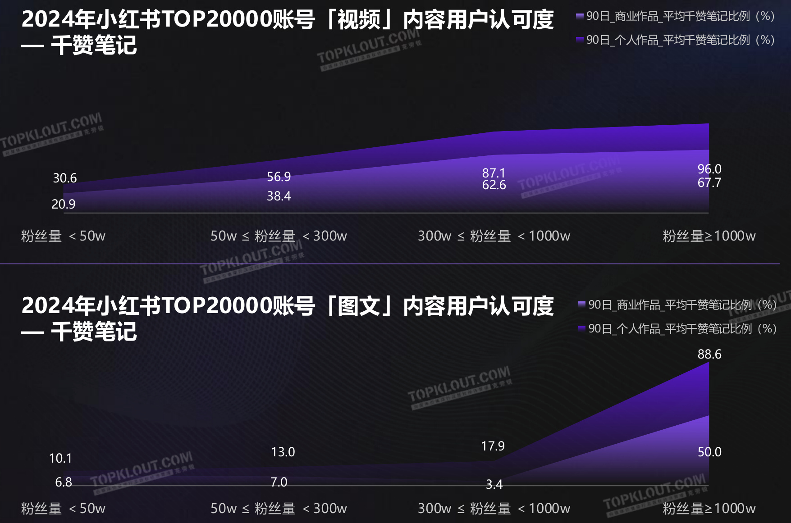

图文+视频 整体千赞笔记比例PKLOUT.COM 23.3 %

商业 千赞比例笔记率15.6 %

千赞比例与粉丝量整体呈正相关头部KOL的高流量和高质量内容高效触发点赞行为，爆款文概率较高；

图文千赞比例显著低于视频超头部KOL在图文笔记中具有绝对性优势，其他量级差异较小；

# 小红书的笔记阅读来源以发现页为主，腰尾部KOL的粉丝主动搜索意愿更为强烈

# 2024年小红书TOP20000账号 —— 笔记阅读来源

头部私域流量价值凸显：头部KOL的「关注页」和「博主个人页」占比突出，用户更倾向于主动访问主页，形成稳定的私域流量池；平台算法对腰肩部账号流量扶持：除头部外，小红书给KOL的「发现页」推流依粉丝量级整体呈正相关，在“去中心化”的策略基础上有意倾斜；腰尾部账号依赖搜索与长尾流量：在「关注」和「搜索」页表现较优，针对细分领域的需求，腰尾部KOL更垂直或关键词优化更精准，用户通过主动搜索触达，体现其长尾内容价值；

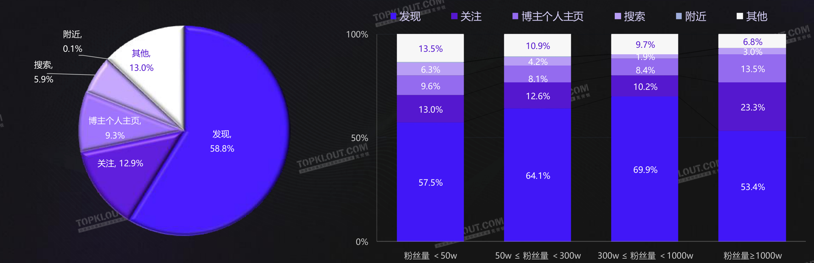  
来源：克劳锐指数研究院自主研究及绘制；注   释    ： 分数析据以统入计驻范蒲围公：2英0的24达.1人2\~对20外2展5.2示 数（据受和平字台段接为口准限，制仅供展参示考近9，0一天切动以态实）际，情小况红为书准平；台粉丝量排名TOP20000创作者中入驻蒲公英创作者的数据表现，统计维度含账号基础信息、内容表现等公开信息（不含商业敏感数据）

# 从 「流量竞争」到「价值竞争」

创新价值 UT.COM 店克劳饭 ror • 情绪价值 营销价值

用户活跃规模、时长和注意力与内容消费走向「内卷化困境」创新价值：新的有生力量快速成长，内容的视觉体验和生产过程同步发生变化

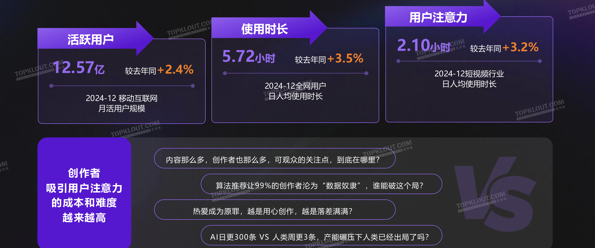  
数据来源： 2024中国移动互联网年度大报告；克劳锐指数研究院根据结果推算；

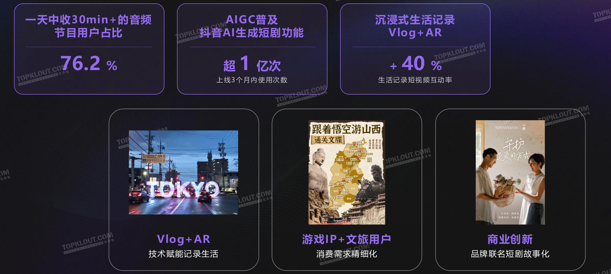  
数据来源：2024年播客行业报告；2024中国移动互联网年度大报告；2024社媒内容生态数据报告

# 情绪价值：跨界内容破圈多元标签重构用户认知

用户消费经验不断积累，消费阈值显著提升，反推达人内容创新和迭代加速内容的情绪性和新鲜感提升，构建用户深层情感链接，提升内容的生命力

# KOL身份跨界

# 跨领域KOL联创

通过「标签叠加」打破内容边界，实现多领域内容产出；

# 如：

科技博主跨界时尚领域，以实验数据解读功能性服饰，实现科技与生活强关联 DUT.CO 克秀

通过「CP式合作」放大内容优势，增加内容趣味性，覆盖多领域受众；

如：  
美食KOLx旅行KOL，以「探店+城  
市文化」模式产出

# 营销价值：从粗放圈层到动态标签化细分，将人设颗粒度与场景化标签重组

# 静态人口标签

性别、年龄、城市等级、职业等

# 复合动态标签

通过「兴趣+场景+行为」的标签矩阵锁定用户，匹配目标KOL，实时捕捉用户需求并管理标签的生命周期

# 精准个体需求匹配

如：某运动服饰品牌

# KOL精准匹配

垂直专家型

# 静态人口标签

25\~35岁女性一线 & 新一线城市白领 & 高校学生复合动态标签瑜伽爱好者晨跑社群组织者时尚穿搭博主

瑜伽教练 @A  分类细化输出准也瑜伽课程，强化用户对产品功能性的认知场景体验型：  
T.COMI生活方式KOL @B  展示产品在职场、出游等多样化使用场景中的搭配应用活动联结型：  
活动组织型KOL @C  发布线下活动组织信息，增强用户的归属感与参与感

# THANK YOU