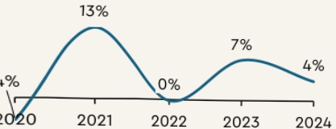
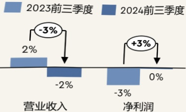
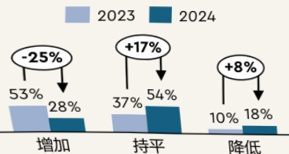
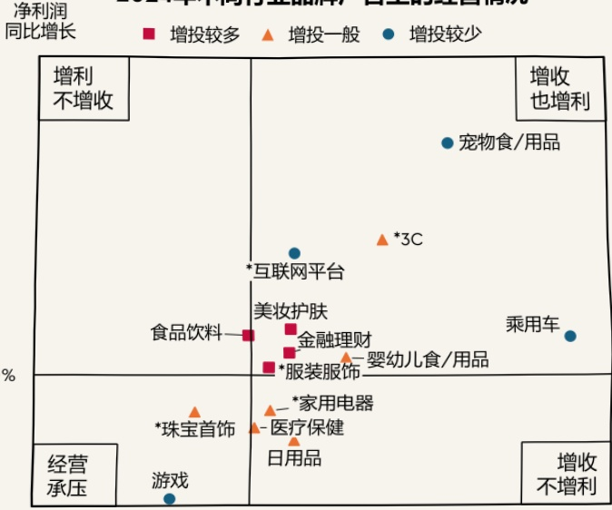

## “痛"则思变：2024年市场回顾

## 消费市场正在经历转型，企业经营聚焦效率，重新思考市场营销

肖费市场逐渐转向新模式，叠加低价和同质化竞争，“增收不增利”成为了多数企业的日常，但这显然无法满足企业长期经营的需要，因此企业们开始关注经营效率的提升。同时，企业也在重新思考市场营销，不断探索着流量焦虑、预算分配和增长捕捉这三大症结的应对之策，形成了在投放方向上的分化。

社会消费品零售总额同比增速

全A股上市公司数据同比增速

## 消费

消费增速放缓带来更加激烈的竞争。经济影响着消费者的预期，引导着消费者的生活观念和消费模式发生转变，也促使广告主重新审视和调整营销预算与策略。

## 经营

企业经营的目标更加关注提升效率。长期低价竞争使得企业经营陷入了“增收不增利”的境况，企业的经营思路开始转向提升效率：近两年的A股上市公司，其净利润的增幅有所改善。

广告主实际投放变化

## 营销

品牌广告主在投放上较为谨慎。在消费增长低速的环境中，品牌广告主在新营销模式上的不断探索，投放出现了新的变化趋势，以求更高的经营投放效率。

## 2024 年不同行业的品牌广告主对于是否增加广告投放有着各自不同的理解

尽管品牌广告主总体的实际投放趋于保守，通过行业的切分我们还是可以发现一些共性：

<html><body><table border="1"><tr><td>增投较多的行业 增投中性的行业 增投较少的行业</td><td>增投较多的行业</td><td>增投中性的行业</td><td>增投较少的行业</td></tr><tr><td>市场增量</td><td>么</td><td>多</td><td>中</td></tr><tr><td>竞争品牌数量</td><td>多</td><td>中性</td><td>少</td></tr><tr><td>品牌溢价承受度</td><td>低</td><td>中性</td><td>高</td></tr><tr><td>营销/行业特征</td><td>增营销以抢占心智</td><td>政策或新需求推动</td><td>新进入者少的垂类行业</td></tr></table></body></html>

2024年不同行业品牌广告主的经营情况

营业收同比增*互联网平台为港股上市的7家国内主要平台；珠宝首饰和服装服饰包含若干港股上市的国内品牌；家用电器为白色家电以及小家电；3C为手机、电视以及电脑。

