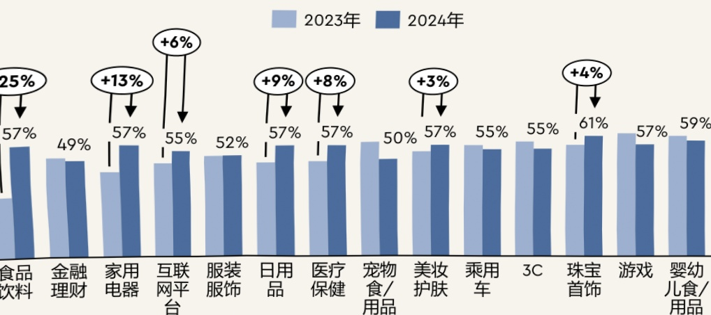
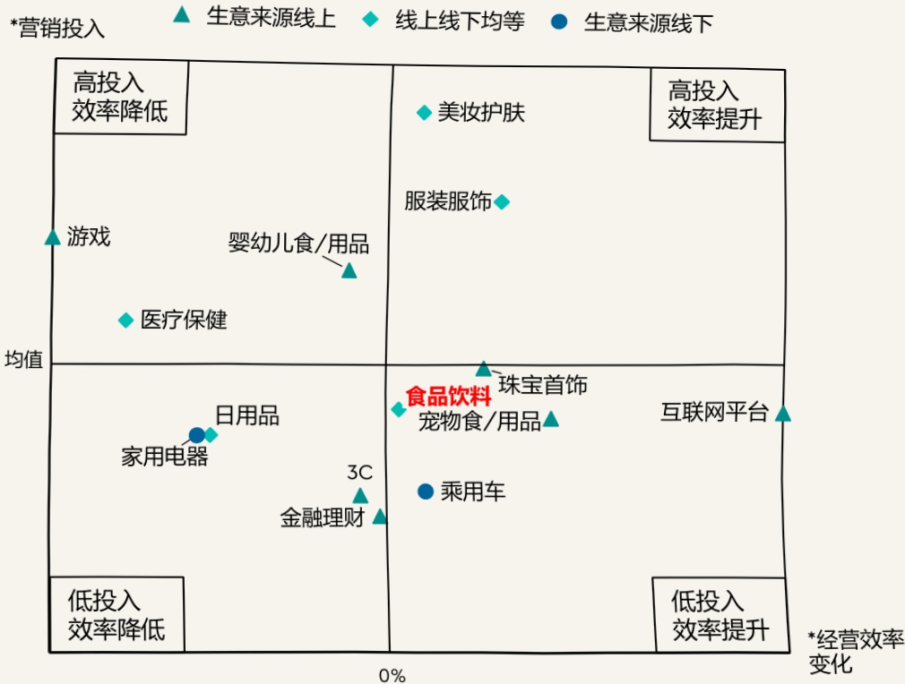

尽管从行业整体来看，线上流量饱和和线下流量难获取构成的流量焦虑是2024年初品牌广告主共同面临的投放挑战，不过分行业来看，如食品饮料和家用电器这样线上投放率低的品牌广告主在2024年大幅增加数字媒体的投放，并仍能收获一波数字化红利。

但是，在经历了2024年的一波增长之后，各行业的线上化投放率整体已经趋近相同，均在55%左右，且2024年行业整体数字化投放占比相较2023年也并未出现明显上涨。由此可见，品牌广告主在数字媒体上的投放份额已经趋于稳定。同时在此共识的驱动下，品牌广告主对于流量的竞争会更加激烈。

不同行业的数字媒体投放费用占总营销费用比

## 但增加数字媒体投放占比并非通用良药

将行业按照营销投入高低、经营效率变化差异进行划分，同时结合行业提升数字媒体投放费用占比来看，可以看出并非一味增加数字媒体投放预算占比就是提升经营效率的解药。

以食品饮料行业为例，该行业的数字投放程度远低于平均水平。通过优化投放思路，在增加数字媒体投放的同时，削减其他媒体的投放预算，有效控制营销费用，是可以借助流量红利实现经营效率的提升。但本身数字营销化率就已经很高的行业，如美妆护肤，较难继续靠提升该比例来实现经营效率的进一步提高。品牌广告主需结合自身业务和市场动态，在基于理解之上持续优化营销点位组合，才能切实提升营销效率。

## 2024 年行业结构性流量红利仍然存在

## 2024 年加大线上媒体投放，对于部分行业仍有流量红利

2024年不同行业品牌广告主营销总投入与经营效率

*经营效率增长情况为营业净利率，即2024年净利润与营业收入的比值与2023年之间的差值*营销投入为销售费用与营业收入的比值

## 2025 年各行业品牌广告主的投放或将迎来新一轮的变革

经历了过去几年高速的线上化发展，尽管短视频、社交种草、电商组成的线上投放三板斧成为多数品牌广告主的投放共识，不过随着各行业的线上化投放率已经几乎持平，线上投放的效率不可避免会进一步降低，且红利难现。流量焦虑、预算分配和增长捕捉这三大症结会显得更加突出。值得注意的是，在2025年的品牌广告主调研中，我们发现品牌广告主们相较2024年出现了更多思考，这些思考中既出现了新的共识，也出现了相应的分化。随着消费市场持续经历转型和技术的快速迭代，过去的营销模式已经不再适用，2025年各行业品牌广告主的投放或将迎来新一轮的变革。

