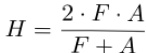

## 2 Task and Evaluation 

In this task, the system needs to generate two inteerrelated predictions from the claim files and the evidence corpus: on the one hand, it needs to predict a veracity label for each claim; on the other hand, it needs to return evidence ids that support the judg ment. Therefore, the input-output format of the task inherently connects claim verification with evidence retrieval. Specifically, each claim contains a claim id and claim text, while the evidence corpus provides evidence passages that can be retrieved by the system. In the training set and development set, each claim also includes a gold claim label and gold evidence ids, which can be used for model training and development-set evaluation. However,the system needs to generate predictions for each claim's label and corresponding evidence because the test set only contains claim information.

The output of the claim label task is given four label spaces, including SUPPORTS,REFUTES, NOT_ENOUGH_INFO, and DISPUTED. SUPPORTS and REFUTES indicate that the evidence supports or refutes the claim.NOT_ENOUGH_INFO indicates that the existing evidence is insufficient to determine the veracity.DISPUTED indicates that the evidence contains disagreement or conflicting conclusions. Unlike the true/false binary classification, this label space is more complex because the system not only needs to identify clear cases of support or refutation but also tell the difference between "insufficient evidence" and "disputed evidence".

According to the reading results from the notebook, the project data includes 1,228 training claims, 154 development claims, 153 unlabelled test claims, and 1,208,827 evidence passages. This means that the number of claims is relatively limited, but the evidence corpus is very large, creating a highly asymmetric retrieval space. Therefore, subsequent models cannot directly process the complete evidence corpus but rather first narrow the search range to a manageable candidate set through evidence retrieval. The training label distribution is also imbalanced, with SUPPORTS, NOT_ENOUGH_INFO, REFUTES and DISPUTED appearing 519, 386, 199 and 124 times respectively. This suggests that the model might trade-off its ability to predict less frequent classes such as REFUTES and DISPUTED, if it overencodes majority-class patterns.

The evaluation is structured as dual-output for 

the task. Evidence retrieval F-score (F) measures the match between predicted evidence ids and gold evidence ids, while claim classification accuracy (A) measures whether the predicted claim label is correct. The two are combined using the harmonic mean (H):

2·F ·A 

This design makes the final score susceptible to imbalance in performance of the two subtasks. Therefore, the evaluation encourages the system to reach a stable trade-off between the quality of evidence and label prediction.

## 3 Data Analysis and Preprocessing 

Before formal modelling, we first read, checked,and preprocessed the project data based on the structure of the claim files and evidence.json. Since the system needs to perform evidence retrieval and claim classification in the later stages, we mainly checked whether the data can be structured in a way that is suitable for retrieval and classification,rather than treating each claim as a stand-alone text input to the model.

Through the data loading results, we confirmed that the main computational pressure comes from the scale of the evidence corpus. Although the number of claims is relatively limited, the corpus contains over 1.2 million evidence passages, so the later models cannot directly scan the entire corpus for deep matching. We thus first converted the evidence corpus into searchable data representations,to prepare it for later candidate evidence retrieval.

We also checked the label distribution and gold evidence distribution of the training set. The label distribution shows that the minority-class samples are fewer than the majority class, which suggests that the subsequent classifier may be affected by class imbalance. In addition, each claim usually corresponds to multiple gold evidences. The average number of evidence for the training set is 3.36 and the average number of evidence for the development set is 3.19. Therefore, evidence output cannot simply be regarded as a single evidence selection problem, but needs to balance between retaining suffi cient evidence and reducing irrelevant evidence.

In the preprocessing step, we mainly converted the raw evidence corpus into formats that could be used for later retrieval. The code generated tokenized evidence for BM25 and used sentencetransformers/all-MiniLM-L6-v2 to generate dense 