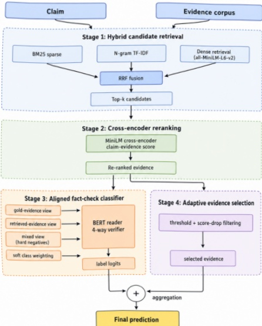
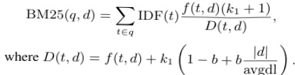

embeddings. Due to the high constructing cost, we used a caching mechanism to store intermediate outputs such as the sparse index, TF-IDF matrix,and dense embeddings. Later experiments could reuse these intermediate results without processing the entire evidence corpus from scratch each time.

Through data preprocessing, the raw data is organised into formats that could be directly used in later stages. The Method section builds on this prepared data and details the design of candidate retrieval, reranking, classification, and related components.

Figure 1: Final architecture of the proposed factverification pipeline. 

## 4 Methodology 

Our system follows a retrieval-centred cascade architecture rather than treating climate-science fact verification as a direct four-way text classification problem. This design is motivated by the output structure of the task: for each claim, the system must predict both a veracity label and a compact set of evidence identifiers. Since the evidence corpus contains more than one million passages, it is computationally infeasible to apply a deep neural reader to every possible claim–evidence pair. We therefore decompose the task into four connected stages: hybrid candidate retrieval, cross-encoder reranking, claim-evidence classification, and adaptive evidence selection. The first two stages determine what information is available to the reader,while the latter two stages determine the submitted label and evidence set. This pipeline structure also makes the system easier to analyse, because retrieval errors, ranking errors, and classification errors can be examined separately.

### 4.1 Hybrid Candidate Retrieval 

The first stage aims to construct a candidate evidence pool with high recall while keeping the number of passages small enough for neural reranking.A purely lexical retriever is often reliable when a climate claim contains explicit scientific entities,numerical values, dates, or technical terms. However, it can fail when the evidence expresses the same information using different wording. Conversely, a dense retriever can recover semantically related passages, but it may also rank topically similar yet non-evidential passages too highly. For this reason, our final implementation combines sparse lexical matching and dense semantic retrieval instead of relying on a single retrieval signal.

BM25 is used as the main sparse retriever because exact term matching is still important for scientific fact verification, especially for claims involving quantities, named reports, climate indicators, and domain-specific terms such as "CO2","temperature anomaly", and "sea level" (1). In the final configuration, we set k1 = 1.2 and b = 0.85,which is consistent with our experimental setup.The relatively high length-normalisation parameter is used to reduce the tendency of long evidence passages to receive high scores simply because they contain many query terms. To make the formula fit the ACL two-column layout, we write the denominator separately:

To complement BM25, we add a TF-IDF retriever with unigram and bigram features. This branch is useful for semi-fixed scientific expressions such as "global warming", "sea level rise",or "greenhouse gas", where phrase-level overlap is more informative than isolated word overlap. In parallel, we use all-MiniLM-L6-v2 as a dense biencoder to embed claims and evidence passages into the same vector space (2; 3). Dense retrieval 